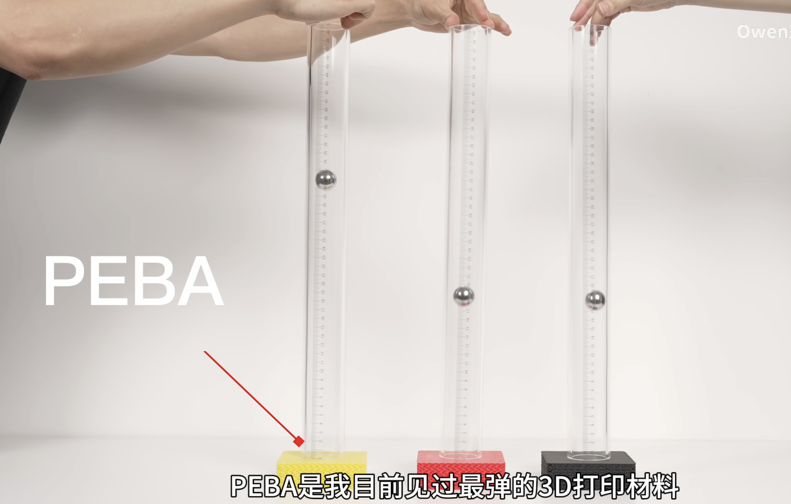

### 5.5

想了一段时间之后想出了1.0 方案，完全齿轮驱动，而且是锥齿轮。

{: width="60%" }

第一个视图是单个手指从手背上方视角；第二个视图是从大拇指向小拇指方向的侧面视角。齿轮的大小不代表真实大小。

+ MIP关节采用差动驱动，两个电机放在手掌上（与 DLR Hand II 比较像，但不一样）
+ DIP的驱动电机放在手指肚上，用椎齿轮传动
+ PIP关节采用连杆，采用一根连杆驱动，与DIP关节耦合（灵感来源于 NASA Robonaut Hand）

（以下齿轮都指锥齿轮）齿轮1、2直连两个电机，齿轮1与齿轮3啮合；齿轮四与齿轮2啮合。齿轮5与齿轮3、4啮合。齿轮6与齿轮5同轴固连，齿轮7与齿轮6啮合，并与第一个骨节固连。齿轮8与电机直连，齿轮9与齿轮8啮合，并与第二骨节固连。第三骨节通过一跟连杆（如图红色的连杆）连接到第一骨节的对应位置

电机采用有刷直流空心杯电机，采用小减速比（具体值没计算过），以提高柔顺性和灵活性。DIP关节的电机采用外走线；其余两个电机内走线。

单个手指设计如上，整手设计中除大拇指外的四根手指采用如上手指，大拇指设计还没想好（因为要四个自由度）

内置电机于手掌的好处就是手腕设计时无需将手指的驱动解耦，或者直接采用机械臂的手腕。缺点就是手掌比较大，灵活性差，考虑散热问题。采用锥齿轮的坏处就是质量大一些，柔顺性不好，刚度大，无法允许脱位，存在回程差；好处是负载能力大一些。后面可以考虑类似思路将锥齿轮换成滑轮用腱绳传动。

### 5.10

1.1 方案

{: width="50%"}

大体结构没变，将电机的位置方向进行调整，同时改变电机的尺寸

### 5.28

电机选型部分

1. 锁定电机类型，目前主流方案使用空心杯电机，可选择有刷或无刷。有刷的可以选择石墨电刷和稀有金属电刷。因石墨电刷导电性不如稀有金属，故采用稀有金属刷或无刷。

2. 选择电机厂商，国外知名厂商：瑞士[Maxon](https://www.maxongroup.com.cn/)、德国[faulhaber](https://www.faulhaber.com/)

3. 根据尺寸选择大概型号，根据前述设计，1.1版本的下面两个电机直径大概在20～25mm，长度（总长）应小于30mm，电机净长大概是12～20mm，按照如上参数在网站寻找对应尺寸的电机，分别为：
   1. maxon:[$\Phi 22,L17$](https://www.maxongroup.com.cn/maxon/view/configurator/BOM:ECXA22LZF50E6ILACO1Y620A)，ECX FLAT 22 L ∅22mm, brushless, BLDC motor，High Torque
   2. faulhaber:[$\Phi 22,L14.8$](https://www.faulhaber.com/en/products/series/2214bxth/#lower)，Brushless DC-Flat Motors Series 2214 ... BXT H External rotor technology, with housing

4. 验证电机动力参数是否满足要求，首先确定所需的运动速度：以人手为标准，测量极限角速度：
   1. 令手指关节反复转动约90度，重复60次，记录所用时间，对6根手指进行记录（左右手中间三根手指的PIP关节），时间分别为16.08、16.89、15.50、15.66、16.36、16.76，（平均16.21），所需运动转速为：$\frac{1}{16.21\div 60\times 2\div4\div 60}=444.17 rpm$
   2. 根据电机输出转速计算大概所需减速比，maxon的18v和36v标称转速分别为9070和8520rpm，对应减速比分别为20.4和19.4；faulhaber的6、12、24v的额定转速分别为1260、2630、2710rpm，对应减速比为：2.8、5.9、6.1
   3. 根据电机输出转矩计算大概输出力，maxon的两个电机标称扭矩分别为：28.3、28mNm，对应输出力矩分别为：577.32mNm、543.2mNm；faulhaber的三个电机输出力矩分别为：9.4、9.7、9.7mNm，对应输出力矩分别为26.32、57.23、59.17mNm。
   4. 计算末端输出力，maxon输出力为11.55N（按照手指长100mm，两个电机差动的力来算），faulhaber为1.19N
   5. 计算堵转末端输出力，maxon电机最大力矩129、126mNm，最大输出力矩2.63Nm、2.44Nm。末端最大输出力为26.3N、24.4N，勉强合适。faulhaber的力矩太小，应该不够用

### 6.1

再次读了一遍之前差动关节的论文，发现人家设计的结构更加靠谱且紧凑。比我这个省下了两个齿轮且完成相同的功能。但是就算如此他们的手指做出来也十分臃肿。到锥齿轮采用的同步带传动，也找不到什么更好的方式传动。因此目前先放弃这个齿轮传动方案。

不过通过他的思路或许可以获得机械臂设计的灵感，实验室目前的机械臂的差动方案是两个电机控制俯仰和滚转的自由度，但是这个方案可以控制俯仰和偏航的自由度，剩下的滚转可以通过解耦来实现（这里图不太好画就先不画了）。因此可以通过三个电机来完成一个三轴相交的三自由度腕关节，其中两个自由度差动。或者可以将这个关节放到肩上。不过在实现上或产生穿模，需要变种方案来解决。

### 6.5

这两天思考出了绳驱手的新方案：采用LIMS的手腕类似的想法。LIMS机械臂的腕关节有三个自由度，其中俯仰和偏航采用四根绳，两个电机实现。

他的等效模型是两个球体相切。而他们的实现方式是通过三根空间连杆，原因是若直接使用球体会导致绳子与球体穿模。与手腕不同的是，手指不需要背向转角跟正向一样大，背向转角可能二十度左右就够了。同时，手腕需要保持各向同性，这样才能最大程度的灵活，但手指在抓取过程中通常不会过多关注其偏航角。偏航角对于手指抓取时的灵活度影响甚微但在接住物体时可以提供更大的命中范围，二者不相矛盾。
因此可以在手指的基关节迁移：手指基关节采用两个球体的滚动关节，需要保证两个球体不打滑，因此可以使用类似齿轮的结构，即球形齿轮。这种齿轮缺点就是负载能力小，加工困难。但是在这个方案中齿轮并没有承受负载，只是起到了轴向支撑的作用，加工困难对于科研来说应该不用考虑那么多吧...因此就是采用四根绳，对角拉，两个电机两个自由度。
关于球形齿轮的设计，由于四个角需要防止绳子穿模，因此需要在角落削去一个圆形的样子，而又因为前向转角大约90～120度左右，所以球形齿轮需要啮合的部份为45～60度左右，偏航方向的会更少，可能两边加起来也就二十多度。

存在新的问题：PIP关节那个自由度的绳子该怎么拉...还没想好

### 6.9

想到一个机器人手腕解耦的方法。由于之前想到的四根绳拉一个关节需要对角的两个采用两根轴将手指的绳子缠绕起来，在手腕俯仰的时候绳子长度是不变的，在偏航的时候长度是变化的，但是可以通过一些方式去补偿，再利用绳子的弹性应该可以解决。然后将滚转的自由度往后挪，挪到肘前面，小臂根上，在手的一坨电机的后面就不用解耦了。但是需要和手腕的另外两个自由度解耦，通过锥绳轮的方式就行。

对于偏航时绳子长度变化的补偿方式，想了好几种，感觉最好的就是错位法。

或者可以根本不用补偿，两个对应的绳子对称排布，这样总长度不变，转手腕的时候手指的电机也需要转，补偿相应的量就可以了。

此外，重新看了一遍FLEEX的视频，发现他们对于滚动关节中穿绳的解决方案是：直接从中间走线。因此好像之前没想好的走线方案也没那么复杂，直接在球形齿轮中间掏一个孔就行了...

另外还想到了一个问题可能需要解决，也可能不需要。就是当收到外力冲击的时候，FLLEX的滚动关节是可以复原的，但是球形齿轮可能出现错齿的情况，需要进行校正。

### 6.12

考完试想到了一个更好的手指结构。

FLLEX手的机械结构使用了很多的绳，简化这一部分，只需要解决两根指骨之间连接的问题。要采用柔性结构连接又要保持不脱出，可以利用滚动副的圆弧中心距离不变的性质。在两个滚动圆的圆心出连一根绳，再发散一下可以用一根绳连两个轴承，滑轮结构这样保持了柔性的同时连接了两根指骨。轴承上面可以采用一个打印件当作滑轮，或者直接采用一个带有凹槽的滑轮。

如此说来，球关节就完全没必要了。因为球关节的连接只能通过驱动绳，不能通过连接滚动中心。因为对于两个自由度运动的球关节来说，中间拉一根绳子需要把球关节中间全部掏空，掏空的锥角是滚动角度的一半。这太夸张了，遂放弃球关节方案。于是采用FLLEX的将PIP关节分成两个单自由度的关节，还是采用弹簧拉绳复位。

此外，为了实现之前就想到的柔性，就是抓取物体时更加贴合物体表面，可以在其他力方向上添加一些被动的自由度。这样的自由度下需要有一定的刚度，但是可以根据外界的力产生被动的柔性。因此另外的想法就是：通过圆弧+斜面的配合，将圆弧沿斜面运动的趋势转化为骨之间的沿之间方向的直线运动。相当于是缩小了运动，增大了力（被动力）。将指骨之间连接的较大的被动力化解成了其他方向上对抗外部冲击的被动力。

### 6.13

在想采用这个方法的时候这个绳子该如何绕线。本质的问题就是如何能让这个绳子两端连在一起，就是让绳子如何形成闭环。

想这个问题的时候没想到更好的解决方案，反倒是想到了一个替代方案，而且有了意想不到的结果。如果将这跟绳子换成一个柔性的连杆，在不改变原有轴承结构的同时解决了绳子无法张紧绕线的问题同时，还带来了一定的柔性。意外之喜了说是

### 6.17

第一版结构设计完成了，然后开完了组会，又有了一些新的想法。

首先是关于TPU连杆，感觉使用轴承不是非常明智。目前对于弹性元件的使用，除了TPU连杆之外还有一个弹簧，用于手指复位的。是否可以将二者结合起来，简化结构设计。

联想到之前看到的一个将两个3D打印材料结合打印的方法：[B站视频](https://www.bilibili.com/video/BV13M41147A1/?spm_id_from=333.337.search-card.all.click&vd_source=9fc312ec06f6a918cacb3ece057fde93)
当初感觉挺有新意的，或许可以把这个方式放到我的复位机构上。让他在本身能执行舒张复位的功能的同时还能使其具有一定的柔性。但是需要保证抓取力方向上的刚性，这样才能最大程度上的做到“本体感受”，通过软件来使这个方向的控制更精确。也就是说，需要在**抓取力方向上做“硬”，其他方向上做“软”**。

前两天看到的一个3D打印的新材料。或许也谈不上多新，但是它真的挺强。[B站视频](https://www.bilibili.com/video/BV1qn5bzaEH4/?spm_id_from=333.337.search-card.all.click&vd_source=9fc312ec06f6a918cacb3ece057fde93)

同时具有超高弹性、超强的层粘性、比TPU强的抗蠕变性、更大的刚度，还有抗疲劳特性。这简直就是对我这个设计对号入座的材料啊。

既然如此，那必须得搞一个PEBA的复位机构，同时满足手在抓取力外方向上的柔性了。具体结构细节还没想好，不过可以考虑将所有的手指关节一体化打印，使用PEBA作为连接，初始的时候需要有一定预紧力。此外关于弹性力的加载方式：需要当手指屈曲的时候弹性力要增加，因此可以使用类似于偏心轮机构，通过偏心使得在滚动时固定两点之间距离增加，此时材料拉伸。

对于在除抓取力之外的其他方向和之前一样，还是采用斜面+圆弧的结构，实现自带柔性。

### 6.18

想到了如何将PEBA和PLA结合的方式。

如果我能一体化打印一整个手指就好了，但是由于两个材料不同，自融性无法保障，因此需要在打印的结构上让二者你中有我，我中有你。因此可如这个视频中的榫卯结构一样，让两个材料互相嵌合，打印出来就会牢不可分

此外，还需要考虑PEBA在关节滚动的过程中不能存在应变（应力）超大的点，中间的地方应该不会出现这种突变，问题就出现在两端，两端位置存在着严重的弯矩和拉应力，因此需要合理设计这个位置的结构。或许可以通过有限元的方法来完成设计。

还有一点就是看到这个材料具有一种特性，就是低于一定的厚度会表现出超级软弹的特性，而稍微高出这个值就会大大增加硬度，因此设计的时候需要严格控制厚度。

还有一点不得不说，如果能让一根手指整个打印出来的话，装配速度会大大增加，难度会大大减小会是一个很大的卖点

### 6.30

2.2版本放弃了，原因是感觉滚动关节+S型弹性元件在受背向力的情况下没有任何抵抗力，而且刚度太差了，打印出来过于依靠弹性元件的刚度，但它本身还是柔软的，因此很难继续推进

现在的想法是抛弃滚动关节，直接使用弹性元件连接两个关节，依靠它的弯曲变形来复位。这样结构更加简单，设计起来更加容易，而且刚度比版本2的更高，但问题是弹性元件很可能会很快变得疲劳。

还有一个想法，既然选择了一体打印，是否可以将绳子也一起打印出来，这个想法之前有过灵光一现，但是很快就被抛弃了，原因是这个打印出来的绳子变形一定非常大，而且负载肯定远低于钢丝绳或编制绳。但是目前想到了一种解决方案，就是打印的绳子截面可不是圆形，可以做成宽高可变的矩形。矩形在绕长边弯曲的时候弯曲应力和应变都比较小，而绕短变弯曲应力应变会很大。因此可以根据关节的位置，减小因为关节转动导致绳子变形带来的额外弯曲应力，这样当绳子长边比较长的时候，所能承受的拉力也会变大，负载也会变大。问题就是如何设计这个绳子的截面。

还有第二个问题，就是这样的绳子如何与电机相连，目前有的一点思路就是可以通过嫁接的方式，手腕以前采用打印的绳子，以后采用传统腱绳，使得手掌部分可以做到一体打印模块化，可快拆快装。